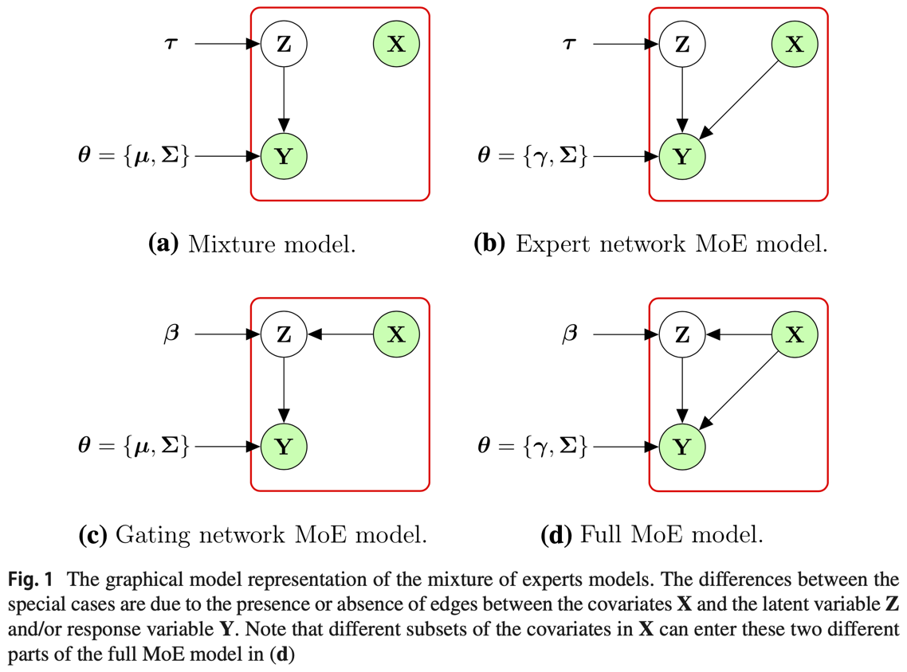

class: middle, center

# Biostatistics for Fluid and Imaging Biomarkers

Michael Donohue, PhD

University of Southern California

### Biomarkers for Neurodegenerative Disorders

Gothenburg, Sweden

May 2024

```{r setup, echo=FALSE, message=FALSE, warning=FALSE}
# renv::activate() # to active renv
# renv::restore() # to update packages according to renv.lock file
# copy any non-CRAN packages to renv:::renv_paths_cellar()
# install.packages(file.path(renv:::renv_paths_cellar(), 'package_file.tar.gz'), repos = NULL)
# devtools::install_url('https://cran.rstudio.com/src/contrib/Archive/calibFit/calibFit_2.1.0.tar.gz')
# remotes::install_github('atrihub/SRS')
# remotes::install_github("gadenbuie/xaringanExtra")
# For ADNIMERGE, go to http://adni.loni.usc.edu/, https://adni.bitbucket.io/

library(Hmisc)
library(knitr)
library(tidyverse)
library(kableExtra)
library(gridExtra)
library(plotly)
library(calibFit)
library(SRS)
library(mixtools)
library(pROC)
library(party)
library(MoEClust)
library(nlme)
library(emmeans)
library(arsenal)
library(mvtnorm)
library(mice)

options(digits=2)

xaringanExtra::use_tile_view() # type 'o' to invoke tile view
theme_set(theme_bw())

# http://www.cookbook-r.com/Graphs/Colors_(ggplot2)/#a-colorblind-friendly-palette
cbbPalette <-
    c("#0072B2", "#D55E00", "#E69F00",
      "#009E73", "#F0E442", "#999999",
      "#000000", "#56B4E9", "#CC79A7")
scale_colour_discrete <-
    function(...) scale_colour_manual(..., values = cbbPalette)
scale_fill_discrete <-
    function(...) scale_fill_manual(..., values = cbbPalette)
scale_colour_discrete <-
    function(...) scale_colour_manual(..., values = cbbPalette)
scale_fill_discrete <-
    function(...) scale_fill_manual(..., values = cbbPalette)

theme_table <- function(..., levs=2){
  theme_minimal(...) + 
    theme(
      panel.grid = element_blank(), 
      axis.text.x = element_blank(),
      axis.text.y = element_text(face='bold', color=cbbPalette[1:levs]),
      axis.title = element_blank())
}

center <- function(x) scale(x, scale = FALSE)
```
  
```{r knitr-options, echo=FALSE, message=FALSE, warning=FALSE, purl=FALSE}
knitr::opts_chunk$set(
  collapse = TRUE,
  comment = NA,
  echo = FALSE, cache = TRUE, 
  cache.path = 'fluid_imaging_cache/',
  fig.path = 'fluid_imaging_fig/',
  dev='svg',
  tidy=FALSE,
  out.extra = '',
  out.width='100%',
  fig.align = 'center', crop = TRUE, fig.pos = '!h', 
  fig.height=3, fig.width=3*2.2,
  message = FALSE, 
  warning = FALSE
)

# knitr::knit_hooks$set(inline = function(x) {
#   prettyNum(x, big.mark=",")
# })
# purl('fluid-and-imaging.Rmd')

```

```{r load_refs, include=FALSE, cache=FALSE, purl=FALSE}
library(RefManageR)
BibOptions(check.entries = FALSE,
  bib.style = "authoryear",
  cite.style = "authoryear",
  style = "markdown",
  hyperlink = FALSE,
  dashed = FALSE,
  max.names = 1)
bib <- ReadBib("./references.bib", check = FALSE)
NoCite(bib, c('calibFit', 'davidian1990', 'Youden', 'pROC', 'ctree', 
  'breiman2001', 'hothorn2006', 'mixtools', 'murphy2020gaussian', 
  'properzi2019nonlinear', 'rowe201718', 'klunk2015centiloid', 
  'navitsky2018standardization', 'royse2021validation', 'li2019bayesian'))
# Citet(), Citep(), AutoCite()
```

.pull-left[

```{r echo=FALSE, fig.align='center', out.width='57%'}
knitr::include_graphics("./images/atri.png")
```

]


.pull-right[

```{r echo=FALSE, fig.align='center', out.width='47%'}
knitr::include_graphics("./images/actc_logo.png")
```

]

---

# Course Overview

.large[
Topics:

- Hour 1 -- Biostatistics for Fluid and Imaging Biomarkers
- Hour 2 -- Modeling Longitudinal Data (Lars Racket)

Emphases:

- Visualization 
- Demonstrations using R, code available from:
  - [https://github.com/atrihub/biomarkers-neuro-disorders](https://github.com/atrihub/biomarkers-neuro-disorders)
]

---

# Session 1 Outline

.large[
- Batch Effects
- Experimental Design (Sample Randomization)
- Statistical Models for Assay Calibration/Quantification
- Classification (Supervised Learning)
  - Logistic Regression
  - Binary Trees
  - Random Forest
- Mixture Modeling (Unsupervised Learning)
  - Univariate
  - Bivariate
- Mixture of Experts (Unsupervised Learning with covariates)
- Reference Regions
- Centiloids
- Harmonization using the Empirical Cumulative Distribution Function (ECDF)
]

---

class: inverse, middle, center

# Batch Effects

---

# Batch Effects: Boxplot

```{r generate_batch_data}
# simulated data with batch effects
set.seed(20200225)

batch_data <- 
  tibble(
    batch = 1:10,
    Sigma = rgamma(n=10, shape=360/10, scale=10), # variance for each batch
    Mean = rnorm(n=10, mean=850, sd=200)) %>% # Mean for each batch
  group_by(batch) %>%
  nest() %>%
  mutate(Biomarker = map(data, ~ rnorm(n=50, .$Mean, .$Sigma))) %>%
  unnest(Biomarker) %>%
  unnest(data) %>%
  ungroup() %>%
  arrange(batch) %>%
  mutate(
    id = 1:(10*50),
    batch = as.factor(batch),
    Biomarker = ifelse(Biomarker<0, 0, Biomarker))
```

```{r batch_data_plot}
ggplot(batch_data, aes(y=Biomarker, x=batch)) +
  geom_boxplot(outlier.shape=NA) +
  geom_dotplot(binaxis='y', stackdir='center', dotsize=0.3, alpha=0.2)
```

---

# Coefficient of Variation

.pull-left[

```{r batch_data_summaries, results='asis', cache=FALSE}
batch_data_sum <- batch_data %>% group_by(batch) %>%
  summarize(
    N=length(Biomarker),
    Mean=mean(Biomarker), 
    SD=sd(Biomarker),
    `SD/Mean = CV (%)`=SD/Mean*100)
batch_data_sum %>%
  kable(digits=2, format = 'html') %>%
  kable_styling(
    bootstrap_options=c('striped', 'condensed'),
    font_size=18, full_width=FALSE)
```

]

.pull-right[

- Coefficient of Variation (CV) = SD/Mean
- Often used for quality control (reject batch with CV > $x$)

]

---

# Testing for Batch Effects

```{r, echo=TRUE, results='markup'}
anova(lm(Biomarker ~ batch, batch_data))
```

* Batch explains a significant amount of the variation in this simulated data
* R note: `batch` variable must be a `factor`, not `numeric` (otherwise, you will get a batch slope)

---

# Batch effects: Confounds

```{r batch_confounds}
low_groups <- subset(batch_data_sum, Mean<median(batch_data_sum$Mean))$batch
batch_data <- batch_data %>%
  mutate(Group = ifelse(batch %in% low_groups, 'A', 'B'))
ggplot(batch_data, aes(y=Biomarker, x=batch)) +
  geom_boxplot(outlier.shape=NA) +
  geom_dotplot(aes(color=Group, fill=Group), 
    binaxis='y', stackdir='center', dotsize=0.3, alpha=0.5)
```

???

Suppose we have groups of interest (say, active vs placebo) that we would like to compare.

Do we see an problem here?

---

# Randomized assignment of samples to plates

```{r batch_randomized}
batch_data$Group <- sample(batch_data$Group, size=nrow(batch_data))
ggplot(batch_data, aes(y=Biomarker, x=batch)) +
  geom_boxplot(outlier.shape=NA) +
  geom_dotplot(aes(color=Group, fill=Group), 
    binaxis='y', stackdir='center', dotsize=0.3, alpha=0.5)
```

???

If we have both groups represented in each batch, we can disentangle batch effects
and group effects

One way to ensure this, is to randomize samples to batches

---

# Experimental Design for Fluid Biomarkers

.large[
- Randomize samples to batches/plates
- Longitudinally collected samples (samples collected over time on same individual):
  - If batch effects are expected to be larger than storage effects, consider randomizing *individuals* to batches (i.e. keep all samples from individual on the same plate)
  - However, if storage effects are a concern, timely sample processing might be preferred.
- Randomization can be stratified to ensure important factors (e.g. treatment group, age, APOE $\epsilon4$) are balanced over batches.
]

---

# Sample Randomization

We use an `R` package [SRS](https://github.com/atrihub/SRS) ("Subject Randomization System"), which we have modified to deal with the constraints of plate capacity, and keeping samples from the same subject together.

(Note this is different than the `SRS` package on CRAN)

```{r randomization}
data(srs_data)
# head(srs_data)

p.func.greedy.if.possible <- function(overallImbalance, treatmentCounts, maxCounts)
{
    cant.go <- treatmentCounts > maxCounts
    if(all(cant.go)) 
      stop("Randomization impossible. Probably need another treatment group.")

    number.of.treatments <- length(overallImbalance)
    k <- which(overallImbalance == min(overallImbalance))
    p.vec <- rep(0, number.of.treatments)
    p.vec[k] <- 1
    p.vec/sum(p.vec)
    p.vec[cant.go] <- 0

    if(all(p.vec == 0)){ # try less greedy
      number.of.treatments <- length(overallImbalance)
      p.star <- 2/3
      k <- which(overallImbalance == min(overallImbalance))
      if (length(k) > 1) {
          k <- sample(k, 1)
      }
      p.vec <- rep((1 - p.star)/(number.of.treatments - 1), number.of.treatments)
      p.vec[k] <- p.star
      p.vec      
      p.vec[cant.go] <- 0
    }
    
    p.vec
}

get.counts <- function(object)
{
  expt <- object@expt
  treatment.names <- expt@treatment.names
  factor.names <- expt@factor.names
  factor.level.names <- expt@factor.level.names
  treatment.names <- expt@treatment.names
  state.matrix <- object@stateTable
  tr.ratios <- object@tr.ratios
  
  tr.assignments <- object@tr.assignments
  tr.assignments$Treatment <- factor(tr.assignments$Treatment, 
    levels = treatment.names)
  tr.assignments$Counts <- factor(tr.assignments$Counts, 
    levels = factor.level.names[[which(factor.names == "Counts")]])
  tr.assignments <- with(tr.assignments, table(Counts, Treatment)) * 
    as.numeric(factor.level.names[[which(factor.names == "Counts")]])
  colSums(tr.assignments)
}  

expt <- ClinicalExperiment(number.of.factors = 3,
  factor.names = c('Counts', 'Group', 'Age'),
  number.of.factor.levels = c(2, 5, 2),
  factor.level.names = 
    list(c(4, 5), 1:5, c('young', 'old')),
  number.of.treatments = 13,
  treatment.names = as.character(1:13))

g.func <- function(imbalances)
{
    factor.weights <- c (1, 100, 1)
    imbalances %*% factor.weights
}

r.obj <- new("cPocockSimonRandomizer", expt, as.integer(20130827), 
  g.func=g.func, p.func = p.func.greedy.if.possible, max.counts = 30)

for(i in 1:nrow(srs_data)){
  r.obj <- randomize(r.obj, as.character(srs_data[i, "ID"]), 
     as.character(srs_data[i, expt@factor.names]))
}
```

```{r, results='asis'}
tr.assignments <- r.obj@tr.assignments %>%
  mutate(
    Treatment = factor(Treatment, levels = r.obj@expt@treatment.names),
    `Subject ID` = 1:nrow(r.obj@tr.assignments)
  ) %>%
  rename(
    Plate = Treatment,
    `Num. of samples` = Counts) %>%
  select(`Subject ID`, `Num. of samples`, Group, Age, Plate)

tr.assignments[1:10, ] %>%
  kable(digits=2, format = 'html') %>%
  kable_styling(
    bootstrap_options=c('striped', 'condensed'),
    font_size=18, full_width=FALSE)
```

---

# Sample Randomization

.pull-left[

```{r}
tab <- with(tr.assignments, table(Plate, Age)) %>%
  as.data.frame() %>%
  pivot_wider(names_from='Age', values_from='Freq') %>%
  t() 
tab <- rbind(tab, `Num. samples`=as.numeric(get.counts(r.obj)))

tab %>%
  kable(digits=2, format = 'html') %>%
  kable_styling(
    bootstrap_options=c('striped', 'condensed'),
    font_size=18, full_width=FALSE)
```

]

.pull-right[

- Number of young and old well balanced across the 13 plates
- Number of samples per plate is also reasonable (plate capacity was set at 30 samples)

]

---

class: inverse, middle, center

# Calibration

---

# Calibration

.large[

- Calibration: developing a map from "raw" assay responses to concentrations (ng/ml) using samples of *known* concentrations
- We will explore some approaches to calibration with methods from the `R` package `calibFit` `r Citep(bib=bib, c('calibFit', 'davidian1990'))`
- The package includes some example data:
  - High Performance Liquid Chromatography (HPLC) and 
  - Enzyme Linked Immunosorbent Assay (ELISA)
- These examples are taken straight from the package vignette

]

???

The package is not actively maintained, so you must install the package from the CRAN archive

---

# Calibration

.pull-leftWider[

```{r calibFit_fits, out.width='100%', fig.height=4, fig.width=4*(2)}
data(HPLC)
data(ELISA)

linmodel <- lm(Response~Concentration, data=HPLC)
# The predicted response
HPLC$Fitted <- fitted(linmodel)

p1 <- ggplot(HPLC, aes(x=Concentration, y=Response)) +
  geom_point() +
  geom_line(aes(y=Fitted)) +
	xlab("Concentration (ng/ml)") +
	ylab("Response") +
	ggtitle("HPLC with ordinary least squares fit")

fplmodel <- with(ELISA,
  calib.fit(Concentration, Response, type="log.fpl")
)
# The predicted response
ELISA$Fitted <- fplmodel@fitted.values

p2 <- ggplot(ELISA, aes(x=log(Concentration), y=Response)) +
  geom_point() +
  geom_line(aes(y=Fitted)) +
	xlab("log(Concentration (ng/ml))") +
	ylab("Response") +
	ggtitle("ELISA with 4 parameter logistic fit")

grid.arrange(p1,p2,nrow=1)
```

]

.pull-rightNarrower[

- *Calibration* curves are estimated using assay responses (vertical axis) from samples of *known* concentration (horizontal axis)
- Curves are subsequently used to map assay responses to estimated concentration values.
- Both fits exhibit *heteroscedasticity*: the error variance is not constant with respect to Concentration
- Most models assume *homoscedasticity*, or constant error variance.

]

---

# Residuals (difference between response & fitted values)

```{r calibFit_residuals, out.width='100%', fig.height=4, fig.width=4*(2)}
p1 <- ggplot(HPLC, aes(x=Concentration, y=Response-Fitted)) +
  geom_point() +
  geom_hline(yintercept = 0) +
	xlab("Concentration (ng/ml)") +
	ylab("Residuals") +
	ggtitle("HPLC with ordinary least squares fit")

p2 <- ggplot(ELISA, aes(x=log(Concentration), y=Response-Fitted)) +
  geom_point() +
  geom_hline(yintercept = 0) +
	xlab("log(Concentration (ng/ml))") +
	ylab("Residuals") +
	ggtitle("ELISA with 4 parameter logistic fit")

grid.arrange(p1,p2,nrow=1)
```

---

# Typical Regression

Typically, regression models are of the form: 

\begin{equation}
Y_{i}=f(x_i,\beta)+\epsilon_{i}, 
\end{equation}

where:

- $Y_{i}$ is the observed response/outcome for $i$th individual ( $i=1,\ldots,n$ ) 
- $x_i$ are covariates/predictors for $i$th individual
- $\beta$ are regression coefficients to be estimated
- $f(\cdot,\cdot)$ is the model (assumed "known" or to be estimated)
  - In linear regression $f(x_i,\beta)=x_i\beta$
- $\epsilon_i$ is the residual error
- We assume $\epsilon\sim\mathcal{N}(0,\sigma^2)$ 
- $\sigma$ is the *constant* standard deviation (*homoscedastic*)

If the standard deviation is not actually constant (*heteroscedastic*), estimates might be unreliable.


---

## Ordinary Least Squares: minimizing the sum of squared residuals

```{r regression-movie, fig.show='animate', dev='jpeg'}
set.seed(20210524)
X <- rnorm(200, mean = 2, sd = 0.5)
e <- rnorm(200, mean = 0, sd = 0.5)
Y <-  X*2 + e 
lmfit <- lm(Y ~ X)
Fitted <- predict(lmfit)

Coef <- lmfit$coef + c(0, 1)

for(i in 1:5){
  Coef <- Coef + c(0, -0.21)
  Fitted <- as.matrix(cbind(1, X)) %*% Coef
  RSS <- sum((Fitted - X)^2)
  p <- qplot(x=X, y=Y) + 
    geom_point() + 
    geom_abline(intercept=Coef[1], slope=Coef[2]) +
    annotate("text", x = 1, y = 7, label = paste('RSS* =', round(RSS, digits = 0)))
  print(p)
}

RSS <- sum(lmfit$residuals^2)
p <- qplot(x=X, y=Y) + 
  geom_point() + 
  geom_abline(intercept=lmfit$coefficients[1], slope=lmfit$coefficients[2]) +
  annotate("text", x = 1, y = 7, label = paste('RSS* =', round(RSS, digits = 0)))
print(p)
```

$^*$ RSS = Residual sum of squares, or $\sum_i (\textrm{Observed}_i-\textrm{Fitted}_i)^2$

---

# Modeling Heteroscedastic Errors

The `calibFit` package includes models of the form: 

\begin{equation}
Y_{ij}=f(x_i,\beta)+\sigma g(\mu_i,z_i,\theta) \epsilon_{ij}, 
\end{equation}

where,

- $Y_{ij}$ are observed assay values/responses for $i$th individual ( $i=1,\ldots,n$ ), $j$th replicate
- $g(\mu_i,z_i,\theta)$ is a function that allows the variances to depend on:
  - $\mu_i$ (the mean response $f(x_i,\beta)$), 
  - covariates $z_i$, and 
  - a parameter ("known" or unknown) $\theta$.
- $\epsilon_{ij}\sim\mathcal{N}(0,1)$ 

In particular, `calibFit` implements the Power of the Mean (POM) function

\begin{equation}
g(\mu_i,\theta) = \mu_i^{2\theta}
\end{equation}

which results in 

\begin{equation}
\operatorname{var}(Y_{ij}) = \sigma^2\mu_i^{2\theta}
\end{equation}

???

allowing the variance to depend on the mean.

---

# "Homogenized" Residuals From Fits with POM

```{r, calib_fit}
cal.fpl <- with(ELISA, calib.fit(Concentration,Response,type="log.fpl"))
cal.lin.pom <- with(HPLC, calib.fit(Concentration,Response,type="lin.pom"))
cal.fpl.pom <- with(ELISA, calib.fit(Concentration,Response,type="log.fpl.pom"))

linpom.fit <- cal.lin.pom@fitted.values
fplpom.fit <- cal.fpl.pom@fitted.values

sig.lin <- cal.lin.pom@sigma
sig.fpl <- cal.fpl.pom@sigma

theta.lin <- cal.lin.pom@theta
theta.fpl <- cal.fpl.pom@theta

linpom.res <- cal.lin.pom@residuals*(1/((linpom.fit^theta.lin)*sig.lin))
fplpom.res <- cal.fpl.pom@residuals*(1/((fplpom.fit^theta.fpl)*sig.fpl))
```

```{r calibFit_pom_residuals, out.width='100%', fig.height=4, fig.width=4*(2)}
p1 <- ggplot(HPLC, aes(x=linpom.fit, y=linpom.res)) +
  geom_point() +
  geom_hline(yintercept = 0) +
	xlab("Fitted Values (LS-POM)") +
	ylab("Standardized Residuals") +
	ggtitle("HPLC with least squares POM")

p2 <- ggplot(ELISA, aes(x=fplpom.fit, y=fplpom.res)) +
  geom_point() +
  geom_hline(yintercept = 0) +
	xlab("Fitted Values (FPL-POM)") +
	ylab("Standardized Residuals") +
	ggtitle("ELISA with 4 parameter logistic POM")

grid.arrange(p1,p2,nrow=1)
```

---

# HPLC Calibration With/Without POM Variance

```{r calib_hplc_pom, fig.height=4.5, fig.width=4.5*2}
par(mfrow=c(1,2))
ciu <- fitted(linmodel) + summary(linmodel)$sigma*qt(.975,linmodel$df)
cil <- fitted(linmodel) - summary(linmodel)$sigma*qt(.975,linmodel$df)

plot(HPLC[, c('Concentration', 'Response')], main = "HPLC data fit without POM",col="blue",pch=16)
lines(HPLC$Concentration,fitted(linmodel),col="lightblue")
lines(HPLC$Concentration,ciu,col="lightblue",lty=2)
lines(HPLC$Concentration,cil,col="grey",lty=2)

plot(cal.lin.pom,print=FALSE,main = "HPLC data fit with POM",xlab = "Concentration", ylab = "Response")
```

???

The mean does not change much, but we get more accurate and tighter 95% confidence bands

---

# Elisa Calibration With/Without POM Variance

```{r calib_elisa_pom, fig.height=4.5, fig.width=4.5*2}
par(mfrow=c(1,2))
#par(mar = c(3.5,3.5,1.5,1.5))
plot(cal.fpl,print=FALSE,main = "ELISA fit without POM",xlab = "Concentration", ylab = "Response")

#par(mar = c(3.5,3.5,1.5,1.5))
plot(cal.fpl.pom,print=FALSE,main = "ELISA fit with POM",xlab = "Concentration", ylab = "Response")
```

---

# Calibrated Estimates & Minimum Detectable Concentration (MCD) for Each Sample

.pull-left[

```{r calibrated1, fig.height=4.5, fig.width=4.5, out.width='100%'}
calib.lin <- calib(cal.lin.pom, HPLC$Response)
plot(calib.lin, main="HPLC calribated with linear POM")
```

]

.pull-right[

```{r calibrated2, fig.height=4.5, fig.width=4.5, out.width='100%'}
calib.fpl <- calib(cal.fpl.pom, ELISA$Response)
plot(calib.fpl, main="ELISA calribated with FPL POM")
```

]

---

# Calibration Statistics

Assuming calibration curve $f$, mapping concentrations to assay responses, is increasing, we define the following terms.

**Minimum Detectable Concentration (MDC)**: The lowest concentration where the curve is increasing, or:

  $$x_{\textrm{MDC}} = \min\{x : f(x, \beta) > \textrm{UCL}_0\}$$
  
  where $\textrm{UCL}_0$ is the upper confidence limit at 0

**Reliable Detection Limit (RDL)**: The lowest concentration that has a high probability of producing a response that is significantly greater than the response at 0, or 
  
$$x_{\textrm{RDL}} = \min\{x : \textrm{LCL}_x > \textrm{UCL}_0 \}$$

**Limit of Quantitization (LOQ)**: The lowest concentration at which the coefficient of variation is less than a fixed percent (default is 20% in the `calibFit` package).

---

class: inverse, middle, center

# Supervised Learning

## Classification

---

# Classification

.pull-leftWider[

```{r classification, fig.height=4, fig.width=6}
dd <- subset(ADNIMERGE::adnimerge, !is.na(ABETA)) %>%
  arrange(RID, EXAMDATE) %>%
  filter(!duplicated(RID)) %>%
  mutate(
    ABETA = as.numeric(gsub('<', '', gsub('>', '', ABETA))),
    TAU = as.numeric(gsub('<', '', gsub('>', '', TAU))),
    PTAU = as.numeric(gsub('<', '', gsub('>', '', PTAU))),
    DX2 = factor(DX, levels = c('CN', 'Dementia')))

ggplot(dd, aes(x=ABETA, y=TAU)) + 
  geom_point(aes(color=DX)) +
  scale_color_manual(values=c("#0072B2", "#E69F00", "#D55E00")) +
  theme(legend.position = c(0.80,0.75))
```

]

.pull-rightNarrower[

- Data from [adni.loni.usc.edu](adni.loni.usc.edu)
- CSF Abeta 1-42 and t-tau assayed using the automated Roche Elecsys and cobas e 601 immunoassay analyzer system
- Filter time points associated with first assay, and ignore subsequent time points
- We'll ignore MCI and focus on CN vs Dementia
- Values greater than the upper limit of detection have been assigned the limit

]

---

# Classification

```{r classification_no_mci}
ggplot(subset(dd, DX!='MCI'), aes(x=ABETA, y=TAU)) + 
  geom_point(aes(color=DX2)) +
  scale_color_manual(values=c("#0072B2", "#D55E00"))
```

---

# Reciever Operating Characteristic (ROC) Curves

.pull-left[

```{r ROC_abeta, fig.width=5, fig.height=5}
roc_abeta <- roc(DX2 ~ ABETA, subset(dd, DX!='MCI'))
# ggroc(roc_abeta)
plot(roc_abeta, print.thres="best", print.thres.best.method="youden")
```

]

.pull-right[

For each potential threshold applied to CSF $\textrm{A}\beta 42$, 
we calculate:
- Sensitivity: True Positive Rate = TP/(TP+FN)
- Specificity: True Negative Rate = TN/(TN+FP)

This traces out the ROC curve.

A typical summary of a classifier's performance is the
Area Under the Curve (AUC)

AUC=`r roc_abeta$auc` in this case, with 95% CI ( `r ci(roc_abeta)[c(1,3)]` )

AUCs close to one indicate good performance.

The threshold shown here maximizes the distance between the curve
and the diagonal line (chance) `r Citep(bib=bib, 'Youden')`

]

???

Sensitivity is a measure of how well we are detecting positive cases

Specificity is a measure of how well we are detecting controls or negative cases

Youden's index gives equal weight to false positives and false negatives (not necessarily appropriate)

---

# Comparing ROC Curves

.pull-left[

```{r ROC_abeta_tau, fig.width=5, fig.height=5}
roc_tau <- roc(DX2 ~ TAU, subset(dd, DX!='MCI'))
roc_tauabeta <- roc(DX2 ~ I(TAU/ABETA), subset(dd, DX!='MCI'))

plot(roc_abeta, col='blue')
plot(roc_tau, add=TRUE, col='orange')
plot(roc_tauabeta, add=TRUE, col='red',
  print.thres="best", print.thres.best.method="youden")
legend("bottomright", 
  legend=c(expression(paste("A", beta)), "Tau", expression(paste("Tau/A", beta))),
       col=c("blue", "orange", "red"), lwd=2)

```

]

.pull-right[


| Marker                 | AUC                  | 95% CI                       | P-value $^*$ |
| ---------------------- |:--------------------:| ----------------------------:| ------------:|
| $\textrm{A}\beta$      | `r roc_abeta$auc`    | `r ci(roc_abeta)[c(1,3)]`    |              |
| Tau                    | `r roc_tau$auc`      | `r ci(roc_tau)[c(1,3)]`      |  0.07        |
| Tau/ $\textrm{A}\beta$ | `r roc_tauabeta$auc` | `r ci(roc_tauabeta)[c(1,3)]` |  <0.001      |
$^*$ Bootstrap test comparing each row to $\textrm{A}\beta$ `r Citep(bib=bib, 'pROC')`

So the ratio of Tau / $\textrm{A}\beta$ shows the best discrimination of NC from Dementia cases.

```{r, echo=FALSE, eval=FALSE}
roc.test(roc_abeta, roc_tau)
roc.test(roc_abeta, roc_tauabeta)
```

]

---

# Youden's Cutoff for Tau / $\textrm{A}\beta$ Ratio

```{r abeta_tau_scatter_youden, fig.height=2.5, fig.width=3*2}
ggplot(subset(dd, DX!='MCI'), aes(x=ABETA, y=TAU)) + 
  geom_point(aes(color=DX2)) +
  scale_color_manual(values=c("#0072B2", "#D55E00")) +
  geom_abline(intercept = 0, slope=0.394)
```

Line is Tau = 0.394 $\times$ Abeta, depicting Youden's cutoff (maximizes sensitivity + specificity)

???

Youden's cutoff maximizing sensitivity + specificity is appropriate if sensitivity and specificity are equally important

---

# Logistic Regression

```{r}
logistic.fit <- glm(DX2 ~ scale(ABETA) + scale(TAU), 
  data = subset(dd, DX!='MCI'), family=binomial)
summary(logistic.fit)$coef %>%
  as_tibble(rownames = NA) %>% 
  rownames_to_column(var='Coefficient') %>%
  mutate(`Pr(>|z|)` = format.pval(round(`Pr(>|z|)`, digits = 3), eps = 0.001, digits=3)) %>%
  kable()
```

$$\log\big(\frac{p}{1-p}\big) = \hat\gamma_0 + A\beta_z \hat\gamma_{A\beta} + \textrm{tau}_z \hat\gamma_{\textrm{tau}}$$
where $\hat\gamma$ are regression coefficients.

---

# Logistic Regression Predicted Probabilities

```{r logistic_pred_prob}
ggplot(subset(dd, DX!='MCI'), aes(x=ABETA, y=TAU)) + 
  geom_point(aes(color=predict(logistic.fit, type='response'))) +
  scale_colour_gradient(low="#0072B2", high="#D55E00") +
  labs(color="Pred. prob. of Dementia") +
  geom_abline(intercept = 0, slope=0.394)
```

???

line again depicts Youden's cutoff

---

# Ratio Contours

```{r ratio_gradient}
ggplot(subset(dd, DX!='MCI'), aes(x=ABETA, y=TAU)) + 
  geom_point(aes(color=TAU/ABETA)) +
  scale_colour_gradient(low="#0072B2", high="#D55E00") +
  labs(color="Tau/Abeta ratio") +
  geom_line(data=data.frame(ABETA=80:1700, TAU=80:1700), 
            aes(color=TAU/ABETA), linetype='dashed') +
  geom_line(data=data.frame(ABETA=80:1700, TAU=1.5*(80:1700)), aes(color=TAU/ABETA)) +
  geom_line(data=data.frame(ABETA=80:1700, TAU=2*(80:1700)), aes(color=TAU/ABETA)) +
  geom_line(data=data.frame(ABETA=80:1700, TAU=1/2*(80:1700)), aes(color=TAU/ABETA)) +
  geom_line(data=data.frame(ABETA=80:1700, TAU=1/3*(80:1700)), aes(color=TAU/ABETA)) +
  geom_line(data=data.frame(ABETA=80:1700, TAU=1/4*(80:1700)), aes(color=TAU/ABETA)) +
  geom_line(data=data.frame(ABETA=80:1700, TAU=1/5*(80:1700)), aes(color=TAU/ABETA)) +
  coord_cartesian(xlim=c(200,1700), ylim=c(80,852))
```

???

by using ratio's we're simplifying the bivariate scatter by assuming all dots along
these lines intersecting (0,0) are equivalent

dashed line has slope 1
---


# Logistic Regression Predicted Probability Contours

```{r ratio_gradient_logistic}
tau_fun <- function(abeta, p){
  # log(p/(1-p)) = y = a + b*abetaz + c*tauz
  # tauz = (y - a - b*abetaz)/c
  abetaz <- (abeta - attr(logistic.fit$model$`scale(ABETA)`, "scaled:center"))/
    attr(logistic.fit$model$`scale(ABETA)`, "scaled:scale")
  tauz <- (log(p/(1-p)) - logistic.fit$coef['(Intercept)']
    - logistic.fit$coef['scale(ABETA)']*abetaz)/
    logistic.fit$coef['scale(TAU)']
  tauz*attr(logistic.fit$model$`scale(TAU)`, "scaled:scale") +
    attr(logistic.fit$model$`scale(TAU)`, "scaled:center")
}
pd <- subset(dd, DX!='MCI') %>%
  mutate(prob = predict(logistic.fit, type='response'))
ggplot(pd, aes(x=ABETA, y=TAU, color=prob)) + 
  geom_point() +
  scale_colour_gradient(low="#0072B2", high="#D55E00") +
  labs(color="Pred. prob. of Dementia") +
  geom_line(data=data.frame(ABETA=80:1700, TAU=tau_fun(80:1700, p=0.01), prob=0.01)) +
  geom_line(data=data.frame(ABETA=80:1700, TAU=tau_fun(80:1700, p=0.1), prob=0.1)) +
  geom_line(data=data.frame(ABETA=80:1700, TAU=tau_fun(80:1700, p=0.25), prob=0.25)) +
  geom_line(data=data.frame(ABETA=80:1700, TAU=tau_fun(80:1700, p=0.5), prob=0.5)) +
  geom_line(data=data.frame(ABETA=80:1700, TAU=tau_fun(80:1700, p=0.75), prob=0.75)) +
  geom_line(data=data.frame(ABETA=80:1700, TAU=tau_fun(80:1700, p=0.9), prob=0.9)) +
  geom_line(data=data.frame(ABETA=80:1700, TAU=tau_fun(80:1700, p=0.99), prob=0.99)) +
  coord_cartesian(xlim=c(200,1700), ylim=c(80,852))
```

???

in contrast, logistic regression assumes the predicted probability gradient follows these
parallel lines

lines now are where predicted probabilities from logistic regression are constant

---

# Comparing ROC Curves

.pull-left[

```{r ROC_logistic, fig.width=5, fig.height=5}
roc_logistic.fit <- roc(DX2 ~ predict(logistic.fit, type='response'), subset(dd, DX!='MCI'))

plot(roc_abeta, col='blue')
plot(roc_tau, add=TRUE, col='orange')
plot(roc_tauabeta, add=TRUE, col='red')
plot(roc_logistic.fit, add=TRUE, col='purple')
legend("bottomright", 
  legend=c(expression(paste("A", beta)), "Tau", expression(paste("Tau/A", beta)), 'Logistic model'),
       col=c("blue", "orange", "red", "purple"), lwd=2)

```

]

.pull-right[


| Marker                 | AUC                      | 95% CI                           | P-value $^*$ |
| ---------------------- |:------------------------:| --------------------------------:| ------------:|
| $\textrm{A}\beta$      | `r roc_abeta$auc`        | `r ci(roc_abeta)[c(1,3)]`        |              |
| Tau                    | `r roc_tau$auc`          | `r ci(roc_tau)[c(1,3)]`          |  0.07        |
| Tau/ $\textrm{A}\beta$ | `r roc_tauabeta$auc`     | `r ci(roc_tauabeta)[c(1,3)]`     |  <0.001      |
| Logisitic model        | `r roc_logistic.fit$auc` | `r ci(roc_logistic.fit)[c(1,3)]` |  <0.001      |
$^*$ Bootstrap test comparing each row to $\textrm{A}\beta$ `r Citep(bib=bib, 'pROC')`

Logistic model ROC is very similar to Tau/ $\textrm{A}\beta$ ratio ROC.

```{r, echo=FALSE, eval=FALSE}
roc.test(roc_abeta, roc_logistic.fit)
```

]

---

# Logistic Regression with Age and APOE

```{r}
logistic.fit2 <- glm(DX2 ~ scale(ABETA) + scale(TAU) + scale(I(AGE+Years.bl)) + as.factor(APOE4), family=binomial, data = subset(dd, DX!='MCI'))
summary(logistic.fit2)$coef %>% 
  as_tibble(rownames = NA) %>% 
  rownames_to_column(var='Coefficient') %>%
  mutate(`Pr(>|z|)` = format.pval(round(`Pr(>|z|)`, digits = 3), eps = 0.001, digits=3)) %>%
  kable()
```

```{r, eval=FALSE}
roc_logistic.fit2 <- roc(DX2 ~ predict(logistic.fit2, type='response'), subset(dd, DX!='MCI'))
roc.test(roc_abeta, roc_logistic.fit2)
roc.test(roc_tauabeta, roc_logistic.fit2)
auc(roc_logistic.fit2); ci(roc_logistic.fit2)
```

This model does not provide much better ROC, either.

---

# Regression Trees

```{r tree1, fig.height=4.5, fig.width=5*(2)}
tree.fit <- ctree(DX2 ~ ABETA + TAU, 
  data = subset(dd, DX!='MCI'), 
  controls = ctree_control(maxdepth=2))
plot(tree.fit)
```

`r Citet(bib=bib, 'ctree')`

???

Regression trees use recursive partitioning to classify data into more and more homogeneous subgroups

---

# Tree-based Methods

```{r tree2}
ggplot(subset(dd, DX!='MCI'), aes(x=ABETA, y=TAU)) + 
  geom_point(aes(color=DX)) +
  scale_color_manual(values=c("#0072B2", "#D55E00")) +
  geom_vline(xintercept = 886) +
  #geom_hline(yintercept = 210) +
  #geom_hline(yintercept = 440) +
  geom_segment(aes(x = 0, y = 210, xend = 886, yend = 210)) +
  geom_segment(aes(x = 886, y = 440, xend = 1700, yend = 440))
```

???

With this shallow tree, we end up with these four partitions of the Abeta-by-Tau scatter

---

# Comparing ROC Curves

.pull-left[

```{r ROC_rf, fig.width=5, fig.height=5}
tree.fit2 <- ctree(DX2 ~ ABETA + TAU, data = subset(dd, DX!='MCI'))
tree.fit2.prob.dem <- predict(tree.fit2, type='prob') %>% 
  lapply(function(x) x[2]) %>% unlist()
rf.fit <- cforest(DX2 ~ ABETA + TAU, data = subset(dd, DX!='MCI'))
rf.fit.prob.dem <- predict(rf.fit, type='prob') %>% 
  lapply(function(x) x[2]) %>% unlist()
roc_tree.fit <- roc(DX2 ~ tree.fit2.prob.dem, subset(dd, DX!='MCI'))
roc_rf.fit <- roc(DX2 ~ rf.fit.prob.dem, subset(dd, DX!='MCI'))

plot(roc_abeta, col='blue')
plot(roc_tau, add=TRUE, col='orange')
plot(roc_tauabeta, add=TRUE, col='red')
plot(roc_logistic.fit, add=TRUE, col='purple')
plot(roc_tree.fit, add=TRUE, col='grey')
plot(roc_rf.fit, add=TRUE, col='black')
legend("bottomright", 
  legend=c(expression(paste("A", beta)), "Tau", expression(paste("Tau/A", beta)), 
      'Logistic model', 'Binary Tree', 'Random Forest'),
    col=c("blue", "orange", "red", "purple", "grey", "black"), lwd=2)
```

]

.pull-right[


| Marker                 | AUC                      | 95% CI                           | P-value $^*$ |
| ---------------------- |:------------------------:| --------------------------------:| ------------:|
| $\textrm{A}\beta$      | `r roc_abeta$auc`        | `r ci(roc_abeta)[c(1,3)]`        |              |
| Tau                    | `r roc_tau$auc`          | `r ci(roc_tau)[c(1,3)]`          |  0.07        |
| Tau/ $\textrm{A}\beta$ | `r roc_tauabeta$auc`     | `r ci(roc_tauabeta)[c(1,3)]`     |  <0.001      |
| Logisitic model        | `r roc_logistic.fit$auc` | `r ci(roc_logistic.fit)[c(1,3)]` |  <0.001      |
| Binary Tree            | `r roc_tree.fit$auc`     | `r ci(roc_tree.fit)[c(1,3)]`     |  <0.001      |
| Random Forest          | `r roc_rf.fit$auc`       | `r ci(roc_rf.fit)[c(1,3)]`       |  <0.001      |
$^*$ Bootstrap test comparing each row to $\textrm{A}\beta$ `r Citep(bib=bib, 'pROC')`

Random Forests `r Citep(bib=bib, c('breiman2001', 'hothorn2006'))` re-fit binary trees on random subsamples of the data, then aggregate resulting trees into a "forest". This results in smoother predictions and a smoother ROC curve.

* All three models should be (cross) validated, since they learn from known Dx.

```{r, echo=FALSE, eval=FALSE}
roc.test(roc_abeta, roc_tree.fit)
roc.test(roc_abeta, roc_rf.fit)
```

]

---

class: inverse, middle, center

# Unsupervised Learning

## Mixture Modeling

---

# Unsupervised Learning

.large[
- The classification techniques we just reviewed can be thought of as *Supervised Learning* in which we attempt to learn known "labels" (CN, Dementia).
- *Mixture Modeling* is type of *Unsupervised Learning* technique in which we try to identify clusters of populations which appear to be arising from different distributions
- Don't confuse *Mixture Models* with *Mixed-Effects Models* (which we'll discuss later)
  - Think: "Mixture of Distributions"
]

---

# Distribution of ABETA

```{r density_Abeta, fig.height=2.25, fig.width=3*(2)}
ggplot(subset(dd, DX!='MCI' & ABETA<1700), aes(x=ABETA)) + 
  geom_histogram(aes(y=..density..), alpha=0.5) +
  geom_density() +
  geom_rug(aes(color=DX))
```

- Distribution is bimodal
- Can we identify the two sub-distributions?
- We'll explore with `mixtools` package `r Citep(bib, 'mixtools')`

---

# Distribution of ABETA

```{r, results='hide', cache=TRUE}
#' Plot a Mixture Component
#' 
#' @param x Input data
#' @param mu Mean of component
#' @param sigma Standard deviation of component
#' @param lam Mixture weight of component
plot_mix_comps <- function(x, mu, sigma, lam) {
  lam * dnorm(x, mu, sigma)
}

set.seed(1)
mixmdl <- normalmixEM(subset(dd, DX!='MCI' & ABETA<1700)$ABETA, k = 2)
## number of iterations= 121

set.seed(1)
mvmixmdl <- mvnormalmixEM(subset(dd, DX!='MCI' & ABETA<1700)[, c('ABETA', 'TAU')], k = 2)
## number of iterations= 91
```

```{r mixture_distribution_Abeta}
data.frame(ABETA = mixmdl$x) %>%
  ggplot(aes(x=ABETA)) +
  geom_histogram(aes(y=..density..), alpha=0.5) +
  stat_function(geom = "line", fun = plot_mix_comps,
                args = list(mixmdl$mu[1], mixmdl$sigma[1], lam = mixmdl$lambda[1]),
                colour = "#D55E00", lwd = 1.5) +
  stat_function(geom = "line", fun = plot_mix_comps,
                args = list(mixmdl$mu[2], mixmdl$sigma[2], lam = mixmdl$lambda[2]),
                colour = "#0072B2", lwd = 1.5) +
  ylab("Density")
```

???

mixture models provide latent class membership probabilities, such as these 

---

# Posterior Membership Probabilities

```{r}
post.df <- as.data.frame(cbind(x = mixmdl$x, mixmdl$posterior)) %>%
  arrange(x) %>% 
  rename(Abeta = x, `Prob. Abnormal` = comp.1, `Prob. Normal` = comp.2)
post.df %>% filter(Abeta > 1030 & Abeta < 1080) %>% kable()

# A reasonable cutoff might be:
# filter(post.df, `Prob. Abnormal` <= `Prob. Normal`)[1,]
```

---

## Bivariate Density

```{r Bivariate_Density}
kd <- with(subset(dd, DX!='MCI' & ABETA<1700)[, c('ABETA', 'TAU')], MASS::kde2d(ABETA, TAU, n = 50))
fig <- plot_ly(x = kd$x, y = kd$y, z = kd$z) %>% add_surface() %>% layout(
  showlegend = FALSE,
  margin = list(l = 0, r = 0, b = 0, t = 0, pad = 0),
  scene = list(
      xaxis = list(title = "Abeta"),
      yaxis = list(title = "Tau"),
      zaxis = list(title = "Density")
    ))

htmlwidgets::saveWidget(fig, "bvdensity_csf_tau.html")
```

<iframe src="bvdensity_csf_tau.html" width="100%" height="500" id="igraph" scrolling="no" seamless="seamless" frameBorder="0"> </iframe>

---

# Bivariate Density Contour Plot

```{r bv_kernel_density}
kd <- with(subset(dd, DX!='MCI' & ABETA<1700)[, c('ABETA', 'TAU')], MASS::kde2d(ABETA, TAU, n = 50))
kdl <- expand.grid(i=1:50, j=1:50) %>%
  mutate(Abeta=NA, Tau=NA, density=NA)
for(r in 1:nrow(kdl)){
  kdl[r, 'Abeta'] <- kd$x[kdl$i[r]]
  kdl[r, 'Tau'] <- kd$y[kdl$j[r]]
  kdl[r, 'density'] <- kd$z[kdl$i[r], kdl$j[r]]
}

ggplot(kdl, aes(Abeta, Tau, z = density)) +
  geom_raster(aes(fill=density))+
  geom_contour(color='white')
```

---

# Bivariate Mixture Model Posterior Probabilities

.pull-left[
```{r mvmix_post_prob, fig.width=5, fig.height=5, out.width='100%'}
post.df2 <- cbind(mvmixmdl$x, mvmixmdl$posterior) %>% 
  as.data.frame() %>% 
  rename(
    `Prob. Abnormal` = comp.1,
    `Prob. Normal` = comp.2
  )

ggplot(post.df2, aes(x=ABETA, y=TAU, color=`Prob. Abnormal`)) + 
  geom_point() +
  scale_colour_gradient(low="#0072B2", high="#D55E00") +
  geom_abline(intercept = 0, slope=0.394) +
  theme(legend.position=c(0.85, 0.82))
```
]
.pull-right[
```{r mvmix_density, fig.width=5, fig.height=5, out.width='100%'}
plot(mvmixmdl, density = TRUE, alpha = c(0.01, 0.05, 0.10), 
  marginal = FALSE, whichplots=3, main2='', 
  xlab2='ABETA', ylab2='TAU',
  col2=c("#D55E00", "#0072B2"))
```
]

???

line on the left is still Youden's cutoff for the ratio

Contours are confidence ellipses at 99%, 95%, and 90% just to help see the shape of the estimated distributions

---

# Mixture of Experts (unsupervised learning with covariates)

```{r echo=FALSE, fig.align='center', out.width='60%'}

```

`r Citet(bib, c('murphy2020gaussian', 'MoEClust'))`

---

# Mixture of Experts (unsupervised learning with covariates)

```{r fig.height=5.9, fig.width=13}
moedata <- dd %>%
  filter(DX!='MCI' & ABETA<1700) %>% 
  select(AGE, APOE4, ABETA, TAU, ADAS13) %>%
  mutate(APOE4 = as.factor(APOE4)) %>%
  na.omit()

moe23 <- MoE_clust(
  moedata %>% select(ABETA, TAU, ADAS13),
  G = 2:4,
  gating = ~ APOE4,
  expert = ~ AGE,
  network.data = moedata
)

plot(moe23, what="gpairs", jitter=TRUE)
# with(moedata, plot(moe23, what="gating", x.axis=APOE4, xlab="APOE4"))
```

MAP = maximum a posteriori classification

---

# Summary of considerations for fluid biomarkers

.large[
- Batch Effects
- Experimental Design (Sample Randomization)
- Statistical Models for Assay Calibration/Quantification
- Classification (Supervised Learning)
  - Logistic Regression
  - Binary Trees
  - Random Forest
- Mixture Modeling (Unsupervised Learning)
  - Univariate
  - Bivariate
  - With covariates (Mixture of Experts)
]

---

class: inverse, middle, center

# Imaging: Reference Regions

---

# Reference Regions

.large[
A common issue with statistical analyses of numeric summaries derived from imaging data is normalization to a reference region. 

Examples:

- Volumetric MRI: regional (e.g. hippocampal) volume relative to Intra-Cranial Volume (ICV)
- Amyloid PET: cortical-to-cerebellum Standardized Uptake Value Ratio (SUVr)

(Also an issue in non-imaging data, e.g. ratio of CSF $\textrm{A}\beta_{1-42}$ to $\textrm{A}\beta_{1-40}$)
]

---

# Beware the "Ratio Fallacy" and "Spurious Correlation"
.large[
> Spurious correlation refers to the correlation between indices that have a common component. A 'per ratio' standard is based on a biological measurement adjusted for some physical measurement by division. Renowned statisticians and biologists (Pearson, Neyman and Tanner) have warned about the problems in interpretation that ratios cause. This warning has been largely ignored. The consequences of using a single ratio as either the dependent or one of the independent variables in a multiple-regression analysis are described. It is shown that the use of ratios in regression analyses can lead to incorrect or misleading inferences. A recommendation is made that the use of ratios in regression analyses be avoided.

`r Citet(bib, 'kronmal1993')` "Spurious correlation and the fallacy of the ratio standard revisited". *Journal of the Royal Statistical Society: Series A*.

Examples abound: %ICV, SUVR, BMI, ...
]

---

# Ratio as Dependent Variable in Regression

```{r }
dd2 <- subset(ADNIMERGE::adnimerge, VISCODE=='bl' & !is.na(Hippocampus) & DX=='CN') %>%
  mutate(
   APOEe4 = ifelse(APOE4>0, 1, 0),
   Sex = factor(PTGENDER, levels = c('Male', 'Female')))
```

```{r , echo=TRUE}
lm_fit1_sex <- lm(I(Hippocampus/ICV*100) ~ Sex, data=dd2)
```

```{r }
summary(lm_fit1_sex)$coef %>%
  as_tibble(rownames = NA) %>% 
  rownames_to_column(var='Coefficient') %>%
  mutate(`Pr(>|t|)` = format.pval(round(`Pr(>|t|)`, digits = 3), eps = 0.001, digits=3)) %>%
  kable()
```

- Signficant association between Sex and Hippocampal Volume (%ICV)!
- (This linear model is essential just a two-sample t-test)
- Model fit to ADNI CN

---

# ICV as Covariate Instead of Denominator

```{r , echo=TRUE}
lm_fit2_sex <- lm(Hippocampus ~ ICV + Sex, data=dd2)
```

```{r }
summary(lm_fit2_sex)$coef %>%
  as_tibble(rownames = NA) %>% 
  rownames_to_column(var='Coefficient') %>%
  mutate(`Pr(>|t|)` = format.pval(round(`Pr(>|t|)`, digits = 3), eps = 0.001, digits=3)) %>%
  kable()
```

- No association between Sex and Hippocampal Volume ( $\text{mm}^3$ )!
- The **spurious association** in first model is driven by denominator (ICV), not numerator (hippocampal volume)

---

# Hippocampus vs ICV and Sex

.pull-leftWider[
```{r hipp_sex_scatter, fig.height=4, fig.width=6}
ggplot(dd2, aes(y=Hippocampus, x=ICV, color=Sex)) +
  geom_point(alpha=0.5) +
  geom_smooth(method='lm') +
  xlab(expression(paste("ICV (", m*m^{3},")"))) +
  ylab(expression(paste("Hippocampus (", m*m^{3},")"))) +
  theme(legend.position = c(0.2, 0.8))
```
]

.pull-rightNarrower[

- For a given ICV, there is not much difference between sexes
- These linear fits are more flexible than model above (two slopes for ICV vs one)

]

---

# Hippocampal volume ( $\textrm{mm}^3$, %ICV, and model-adjusted)

```{r hipp_sex_box, fig.height=4, fig.width=4*2}
p1 <- ggplot(dd2, aes(y=Hippocampus, x=Sex)) +
  geom_boxplot(outlier.shape=NA) +
  geom_dotplot(binaxis='y', stackdir='center', 
    dotsize=0.3, alpha=0.2, binwidth=100) +
  xlab('') + ylab(expression(paste("Hippocampus (", m*m^{3},")")))

p2 <- ggplot(dd2, aes(y=ICV, x=Sex)) +
  geom_boxplot(outlier.shape=NA) +
  geom_dotplot(binaxis='y', stackdir='center', 
    dotsize=0.3, alpha=0.2, binwidth=15000) +
  xlab('') + ylab(expression(paste("ICV (", m*m^{3},")")))

p3 <- ggplot(dd2, aes(y=(Hippocampus/ICV*100), x=Sex)) +
  geom_boxplot(outlier.shape=NA) +
  geom_dotplot(binaxis='y', stackdir='center', 
    dotsize=0.3, alpha=0.2, binwidth=0.0075) +
  xlab('') + ylab("Hippocampus (%ICV)")

p4 <- ggplot(dd2, 
  aes(y=Hippocampus-ICV*coef(lm_fit2_sex)['ICV'], x=Sex)) +
  geom_boxplot(outlier.shape=NA) +
  geom_dotplot(binaxis='y', stackdir='center', 
    dotsize=0.3, alpha=0.2, binwidth=100) +
  xlab('') + ylab(expression(paste("Hippocampus (", m*m^{3},", model-adjusted for ICV)")))

grid.arrange(p1,p2,p3,p4, nrow=1)
```

---

# Hippocampal volume ( $\textrm{mm}^3$, %ICV, and model-adjusted)

.pull-leftWider[

```{r hipp_adj_sex_scatter, fig.height=4, fig.width=6}
ggplot(dd2, 
  aes(y=Hippocampus-ICV*coef(lm_fit2_sex)['ICV'], x=ICV, color=Sex)) +
  geom_point(alpha=0.5) +
  geom_smooth(method='lm') +
  xlab(expression(paste("ICV (", m*m^{3},")"))) +
  ylab(expression(paste("Hippocampus (", m*m^{3},", model-adjusted for ICV)"))) +
  theme(legend.position = c(0.2, 0.8))
```

]

.pull-rightNarrower[

- Model: 
.small[
$Y_i=\beta_0 + \beta_{\textrm{ICV}}\textrm{ICV}_i  + \beta_{\textrm{Male}}\textrm{Male}_i + \varepsilon_i$
]
- Adjusted volume: $Y_i - \hat{\beta}_{\textrm{ICV}}\textrm{ICV}_i$ 
- Adjustment removes slope for ICV

]

---

class: inverse, middle, center

# Centiloids

---

# Centiloids

.large[

- Centiloids have become the industry standard standardized measure of amyloid PET `r Citep(bib=bib, 'klunk2015centiloid')`
- Helpful in multi-site studies where different amyloid PET tracers might be utilized.
- What is a centiloid?

]

---

# What is a centiloid? Step 1: PiB SUVr to CL

.large[

- The original/base PiB SUVr to centiloid map:
- 1.009 PiB SUVr (mean in young controls) $\rightarrow$ 0 CL
- 2.076 PiB SUVr (mean in AD cases) $\rightarrow$ 100 CL
- For other PiB SUVr values, draw the line from (1.009 SUVr, 0 CL) to (2.076 SUVr, 100 CL)
- CL = 100 $\times$ (PiB SUVr - 1.009)/1.067 `r Citep(bib=bib, 'klunk2015centiloid')`

]

---

# What is a centiloid? Step 1: PiB SUVr to CL

```{r }
ggplot() + 
  geom_segment(aes(x=1.009, y=0, xend=2.076, yend=100),
    arrow = arrow(length = unit(0.03, "npc"), ends='both')) +
  geom_abline(slope = 100/(2.076-1.009), 
    intercept=-1.009*100/(2.076-1.009), linetype='dashed') +
  geom_point(aes(x=1.009, y=0)) +
  geom_point(aes(x=2.076, y=100)) +
  xlab('PiB SUVr') + ylab('Centiloid') +
  xlim(1, 3) + ylim(-5, 200)
   
```

---

# What is a centiloid? Step 2: Other SUVr to PiB SUVr

.large[

- Step 2 requires *paired* data: each individuals scanned with PiB and the other tracer
- Linear regression (ordinary least squares) is used to create linear transformation
- Transformed data is then mapped to CL using map on prior slide

]

---

# What is a centiloid? Step 2: Other SUVr to PiB SUVr

```{r echo=FALSE, fig.align='center', out.width='75%', purl=FALSE}
knitr::include_graphics("./images/rowe2017.png")
```

$\textrm{SUVR}_{\textrm{FBB}} = 0.61 \times  \textrm{SUVR}_{\textrm{PiB}} + 0.39$

`r Citet(bib=bib, 'rowe201718')`

---

# Distribution mapping

```{r echo=FALSE, fig.align='center', out.width='75%', purl=FALSE}
knitr::include_graphics("./images/properzi2019.png")
```

`r Citet(bib=bib, 'properzi2019nonlinear')`

???

Another approach to normalizing data from different tracers (or fluid assays for that matter) is to map distributions.

If we only have unpaired data from similar populations, we can map one to other under the assumption that their distributions should have similar shape.

---

# Emprical Cumulative Distribution Function (ECDF)

```{r echo=FALSE}
pibids <- unique(subset(ADNIMERGE::adnimerge, !is.na(PIB))$RID)
av45ids <- unique(subset(ADNIMERGE::adnimerge, !is.na(AV45))$RID)
set.seed(20210506)
holdout <- sample(intersect(pibids, av45ids), size = 10)

dd <- ADNIMERGE::adnimerge %>%
  filter(!RID %in% holdout) %>%
  arrange(RID, EXAMDATE) %>%
  select(RID, DX, PIB, AV45) %>%
  rename(PiB = PIB, Florbetapir = AV45) %>%
  mutate(PiB = as.numeric(PiB), Florbetapir = as.numeric(Florbetapir)) %>%
  group_by(RID) %>%
  fill(DX, .direction = "downup") %>%
  filter(!is.na(PiB) | !is.na(Florbetapir)) %>%
  filter(!duplicated(RID)) %>%
  pivot_longer(cols=c('PiB', 'Florbetapir'), names_to='Tracer', values_to='SUVR') %>%
  mutate(Tracer = factor(Tracer, levels = c('PiB', 'Florbetapir'))) %>%
  filter(!is.na(SUVR))
  
ggplot(dd, aes(x=SUVR)) +
  stat_ecdf(geom = "step") +
  facet_grid(.~Tracer, scales='free_x')
```

???

CDFs are useful one-to-one maps

Underlie random number generators. A random number from a uniform 0-1 distribution can be mapped to any other distribution by the inverse CDF.

In this case we can map PiB SUVRs to florbetapir SUVRs or vice versa

But it only works if samples are similar, and we believe both tracers would sort the samples similarly.

---

# Weighted ECDFs to correct for sampling differences

N (%) per diagnosis and tracer:

```{r , echo=FALSE}
t1 <- with(dd, table(DX, Tracer))
t2 <- round(with(dd, prop.table(table(DX, Tracer), margin = 2))*100, 1)
tt <- t1
tt[,1] <- paste(t1[,1], paste0("(", t2[,1], "%)"))
tt[,2] <- paste(t1[,2], paste0("(", t2[,2], "%)"))
kable(tt)
```

Inverse proportion weights:

```{r }
invproptab <- 1/with(dd, prop.table(table(DX, Tracer), margin = 2))
kable(invproptab)
```

???

similar methodology underlies CDC growth charts that provide height and weight 
percentiles per age 

---

# Weighted ECDFs to correct for sample differences

```{r , echo=TRUE}
# Record the sampling adjustment weights in the data
dd <- dd %>% mutate(
  wt = case_when(
    DX == 'CN' & Tracer == 'PiB' ~ invproptab['CN', 'PiB'],
    DX == 'MCI' & Tracer == 'PiB' ~ invproptab['MCI', 'PiB'],
    DX == 'Dementia' & Tracer == 'PiB' ~ invproptab['Dementia', 'PiB'],
    DX == 'CN' & Tracer == 'Florbetapir' ~ invproptab['CN', 'Florbetapir'],
    DX == 'MCI' & Tracer == 'Florbetapir' ~ invproptab['MCI', 'Florbetapir'],
    DX == 'Dementia' & Tracer == 'Florbetapir' ~ invproptab['Dementia', 'Florbetapir']
  ))
```

---

# Weighted ECDFs to correct for sample differences

```{r, echo=FALSE}
ecdf.func <- function(x, weights=NULL, 
  type=c('i/n','(i-1)/(n-1)','i/(n+1)'), 
  normwt=TRUE, na.rm=TRUE,
  method = "linear", rule = 2, ...)
{
 type <- match.arg(type)
 ecdf.data <- Hmisc::wtd.Ecdf(x, weights=weights, type=type, 
  normwt=normwt, na.rm=na.rm)
 with(ecdf.data, approxfun(x, ecdf,
  na.rm=na.rm, rule = rule, ...))
}

inv.ecdf <- function(x, weights = NULL, probs = seq(0,1,by=0.01), 
  type = c("quantile", "(i-1)/(n-1)", "i/(n+1)", "i/n"), normwt = TRUE, 
  na.rm = TRUE, rule = 2, ...)
{
 type <- match.arg(type)
 inv.ecdf.data <- as.numeric(
    Hmisc::wtd.quantile(x, weights=weights, probs=probs, type=type,
     normwt=normwt, na.rm=na.rm))

 approxfun(probs, inv.ecdf.data, rule=rule, na.rm=na.rm, ...)
}
```

```{r , echo=TRUE}
# Create adjusted ECDF functions (mapping SUVRs to Cumulative Probabilities)
# Hmisc::wtd.Ecdf returns a data.frame evaluating the ECDF at each observed value
PiB.ecdf <- with(subset(dd, Tracer == 'PiB'), ecdf.func(SUVR, weights=wt))
Fbp.ecdf <- with(subset(dd, Tracer == 'Florbetapir'), ecdf.func(SUVR, weights=wt))

# Create adjusted **inverse** ECDF functions 
# mapping Cumulative Probabilities (0 to 1 scale) to SUVRs
PiB.inv.ecdf <- with(subset(dd, Tracer == 'PiB'), 
 inv.ecdf(SUVR, weights=wt))
Fbp.inv.ecdf <- with(subset(dd, Tracer == 'Florbetapir'),  
 inv.ecdf(SUVR, weights=wt))
```

---

# Weighted ECDFs to correct for sample differences

```{r , echo=TRUE}
dd <- dd %>% mutate(
  `Adjusted cumulative probability` = case_when( # 
    Tracer == 'PiB' ~ PiB.ecdf(SUVR),
    Tracer == 'Florbetapir' ~ Fbp.ecdf(SUVR)),
  `Adjusted Z-score` = qnorm(`Adjusted cumulative probability`), # adjusted z-scores
  `Florbetapir to PiB adjusted SUVR` = case_when(
    Tracer == 'Florbetapir' ~ PiB.inv.ecdf(Fbp.ecdf(SUVR))),
  `PiB to Florbetapir adjusted SUVR` = case_when(
    Tracer == 'PiB' ~ Fbp.inv.ecdf(PiB.ecdf(SUVR))),
  CL = case_when(
    Tracer == 'PiB' ~ 100*(SUVR - 1.009)/1.067)) %>%
  arrange(Tracer, SUVR)
```

---

# Weighted ECDFs to correct for sample differences

```{r weighted-ecdfs}
ggplot(dd, aes(x=SUVR)) +
  stat_ecdf(geom = "step") +
  facet_grid(.~Tracer, scales='free_x') +
  geom_line(aes(x=SUVR, y=`Adjusted cumulative probability`), linetype='dashed') +
  ylab('Cumulative Probability')
```

* solid line is un-adjusted ECDF; dashed line is ECDF adjusted for sample differences

---

# Centiloids vs ADNI Adjusted Percentiles

```{r}
dd %>% filter(Tracer == 'PiB') %>%
  ggplot(aes(x=CL, y=`Adjusted cumulative probability`)) +
  geom_line() +
  geom_point()
```

---

# Densities for estimated and actual PiB SUVRs

```{r pib-densities}
dd %>% select(RID, DX, Tracer, SUVR, `Florbetapir to PiB adjusted SUVR`) %>%
  pivot_longer(c('SUVR', 'Florbetapir to PiB adjusted SUVR'), 
    names_to = 'Source', values_to = 'SUVR') %>%
  filter( (Tracer == 'PiB' & Source == 'SUVR') |
      (Tracer == 'Florbetapir' & Source == 'Florbetapir to PiB adjusted SUVR')) %>%
  mutate(Source = ifelse(Source == 'SUVR', 
    'Directly observed PiB SUVR', 'ECDF mapped Florbetapir to PiB SUVR')) %>%
ggplot(aes(x=SUVR, color=Source)) +
  geom_density(alpha=0.5)
```

???

Not perfectly matched due to different sample characteristics. To be expected.

Recall PiB had less representation of CU and Florbetapir had more with dementia

---

# Densities by diagnosis

```{r pib-densities-dx}
dd %>% select(RID, DX, Tracer, SUVR, `Florbetapir to PiB adjusted SUVR`) %>%
  pivot_longer(c('SUVR', 'Florbetapir to PiB adjusted SUVR'), 
    names_to = 'Source', values_to = 'SUVR') %>%
  filter( (Tracer == 'PiB' & Source == 'SUVR') |
      (Tracer == 'Florbetapir' & Source == 'Florbetapir to PiB adjusted SUVR')) %>%
  mutate( Source = ifelse(Source == 'SUVR', 'Directly observed PiB SUVR', 'ECDF mapped Florbetapir to PiB SUVR')) %>%
  filter(!is.na(DX)) %>%
ggplot(aes(x=SUVR, color=Source)) +
  geom_density(alpha=0.5) +
  facet_grid(.~DX)
```

---

# Densities for weighted ECDF derived z-scores

```{r z-score-densities}
ggplot() +
  geom_rug(data = subset(dd, Tracer == 'Florbetapir'), 
    aes(x=`Adjusted Z-score`, color = Tracer), alpha=0.5) +
  geom_rug(data = subset(dd, Tracer == 'PiB'), 
    aes(x=`Adjusted Z-score`, color = Tracer), alpha=0.5) +
  geom_density(data = subset(dd, Tracer == 'Florbetapir'), 
    aes(x=`Adjusted Z-score`, color = Tracer), alpha=0.5) +
  geom_density(data = subset(dd, Tracer == 'PiB'), aes(x=`Adjusted Z-score`, color = Tracer))
```

Useful for analysis, as in `r Citet(bib, 'li2019bayesian')`

???

Useful for analysis

---

# Using the ECDF derived z-scores for analysis

.pull-left[

```{r echo=FALSE, fig.align='center', out.width='95%', purl=FALSE}
knitr::include_graphics("./images/li2019.png")
```

]

.pull-right[

* ECDF derived z-scores were used in model (assuming Gaussian residuals)
* Posterior estimates (on z-score scale) then back transformed to cumulative probabilities
* Natural interpretation:
  * 0 (most healthy) to 1 (most severe) 
  * Comparable across different measures

`r Citep(bib, 'li2019bayesian')`

]

---

# Validation on a holdout set with both tracers (FBB $\rightarrow$ PiB)

```{r }
dd.validate <- full_join(
  ADNIMERGE::adnimerge %>% 
    arrange(RID, EXAMDATE) %>% 
    select(RID, EXAMDATE, PIB) %>%
    rename(PiB = PIB) %>%
    filter(RID %in% holdout) %>%
    filter(!is.na(PiB)) %>%
    filter(!duplicated(RID)),
  ADNIMERGE::adnimerge %>% 
    arrange(RID, EXAMDATE) %>% 
    select(RID, EXAMDATE, AV45) %>%
    rename(Florbetapir = AV45) %>%
    filter(RID %in% holdout) %>%
    filter(!is.na(Florbetapir)) %>%
    filter(!duplicated(RID)), by='RID', suffix = c('.PiB', '.Fbp')
  ) %>%
  mutate(
    `Years between scans` = as.numeric(EXAMDATE.Fbp - EXAMDATE.PiB)/365.25,
    `Royse et al linear map of PiB to Florbetapir` = 
      as.numeric(0.497 * PiB + 0.503),
    `Royse et al linear map of Florbetapir to PiB` = 
      as.numeric((Florbetapir - 0.503)/0.497),
    `Navitsky et al linear map of PiB to Florbetapir` = 
      as.numeric(0.536 * PiB + 0.502),
    `Navitsky et al linear map of Florbetapir to PiB` = 
      as.numeric((Florbetapir - 0.502)/0.536),
    `ECDF map of Florbetapir to PiB` = PiB.inv.ecdf(Fbp.ecdf(Florbetapir)),
    `ECDF map of PiB to Florbetapir` = Fbp.inv.ecdf(PiB.ecdf(PiB))
  )

fbb2pib_navitsky <- dd.validate %>%
  select(RID, `Years between scans`, PiB, 
    `Navitsky et al linear map of Florbetapir to PiB`,
    `ECDF map of Florbetapir to PiB`) %>%
  rename(
    `Navitsky et al linear map*` = `Navitsky et al linear map of Florbetapir to PiB`,
    `ECDF map` = `ECDF map of Florbetapir to PiB`) %>%
  pivot_longer(c('Navitsky et al linear map*', 'ECDF map'), 
    names_to = 'Method', values_to = 'Estimated PiB SUVR')

fbb2pib_navitsky_RMSE <- fbb2pib_navitsky %>% group_by(Method) %>%
  summarise(RMSE = sqrt(mean((PiB-`Estimated PiB SUVR`)^2))) %>%
  mutate(PiB = 2, `Estimated PiB SUVR` = 0.75,
    text = paste0('RMSE=', round(RMSE, digits=3)))

ggplot(fbb2pib_navitsky, aes(x=PiB, y=`Estimated PiB SUVR`)) +
  geom_point(aes(color=`Years between scans`)) +
  geom_abline(intercept = 0, slope=1) +
  facet_grid(.~Method) +
  xlab('Actual PiB SUVR') +
  geom_text(data=fbb2pib_navitsky_RMSE, aes(label=text)) +
  geom_hline(yintercept = 1.5, linetype='dashed') +
  geom_vline(xintercept = 1.5, linetype='dashed')
```

$^*$ Using PiB = (Florbetapir - 0.502)/0.536 from `r Citet(bib=bib, 'navitsky2018standardization')`

???

We held out a random sample of 10 participants with both PiB and FBB

Note that the linear mapping from Navitsky is estimating PiB values outside of 
the observed range of actual PiB values (near 0.75). 

This will never happen with ECDF mapping.

---

# Validation on a holdout set with both tracers (PiB $\rightarrow$ FBB)

```{r }
pib2fbb_navitsky <- dd.validate %>%
  select(RID, `Years between scans`, Florbetapir, 
    `Navitsky et al linear map of PiB to Florbetapir`,
    `ECDF map of PiB to Florbetapir`) %>%
  rename(
    `Navitsky et al linear map*` = `Navitsky et al linear map of PiB to Florbetapir`,
    `ECDF map` = `ECDF map of PiB to Florbetapir`) %>%
  pivot_longer(c('Navitsky et al linear map*', 'ECDF map'), 
    names_to = 'Method', values_to = 'Estimated Florbetapir SUVR')

pib2fbb_navitsky_RMSE <- pib2fbb_navitsky %>% group_by(Method) %>%
  summarise(RMSE = sqrt(mean((Florbetapir-`Estimated Florbetapir SUVR`)^2))) %>%
  mutate(Florbetapir = 1.5, `Estimated Florbetapir SUVR` = 0.75,
    text = paste0('RMSE=', round(RMSE, digits=3)))

ggplot(pib2fbb_navitsky, aes(x=Florbetapir, y=`Estimated Florbetapir SUVR`)) +
  geom_point(aes(color=`Years between scans`)) +
  geom_abline(intercept = 0, slope=1) +
  facet_grid(.~Method) +
  xlab('Actual Florbetapir SUVR') +
  geom_text(data=pib2fbb_navitsky_RMSE, aes(label=text)) +
  geom_hline(yintercept = 1.11, linetype='dashed') +
  geom_vline(xintercept = 1.11, linetype='dashed')
```

$^*$ Using Florbetapir = PiB $\times$ 0.536 + 0.502 from `r Citet(bib=bib, 'navitsky2018standardization')`

???

This type of approach could also be useful for standardizing fluid assays

---

# Validation on a holdout set with both tracers (FBB $\rightarrow$ PiB)

```{r }
fbb2pib_royse <- dd.validate %>%
  select(RID, `Years between scans`, PiB, 
    `Royse et al linear map of Florbetapir to PiB`,
    `ECDF map of Florbetapir to PiB`) %>%
  rename(
    `Royse et al linear map*` = `Royse et al linear map of Florbetapir to PiB`,
    `ECDF map` = `ECDF map of Florbetapir to PiB`) %>%
  pivot_longer(c('Royse et al linear map*', 'ECDF map'), 
    names_to = 'Method', values_to = 'Estimated PiB SUVR')

fbb2pib_royse_RMSE <- fbb2pib_royse %>% group_by(Method) %>%
  summarise(RMSE = sqrt(mean((PiB-`Estimated PiB SUVR`)^2))) %>%
  mutate(PiB = 2, `Estimated PiB SUVR` = 0.75,
    text = paste0('RMSE=', round(RMSE, digits=3)))

ggplot(fbb2pib_royse, aes(x=PiB, y=`Estimated PiB SUVR`)) +
  geom_point(aes(color=`Years between scans`)) +
  geom_abline(intercept = 0, slope=1) +
  facet_grid(.~Method) +
  xlab('Actual PiB SUVR') +
  geom_text(data=fbb2pib_royse_RMSE, aes(label=text)) +
  geom_hline(yintercept = 1.5, linetype='dashed') +
  geom_vline(xintercept = 1.5, linetype='dashed')
```

$^*$ Using PiB = (Florbetapir - 0.503)/0.497 from `r Citet(bib=bib, 'royse2021validation')`

???

---

# Validation on a holdout set with both tracers (PiB $\rightarrow$ FBB)

```{r }
pib2fbb_royse <- dd.validate %>%
  select(RID, `Years between scans`, Florbetapir, 
    `Royse et al linear map of PiB to Florbetapir`,
    `ECDF map of PiB to Florbetapir`) %>%
  rename(
    `Royse et al linear map*` = `Royse et al linear map of PiB to Florbetapir`,
    `ECDF map` = `ECDF map of PiB to Florbetapir`) %>%
  pivot_longer(c('Royse et al linear map*', 'ECDF map'), 
    names_to = 'Method', values_to = 'Estimated Florbetapir SUVR')

pib2fbb_royse_RMSE <- pib2fbb_royse %>% group_by(Method) %>%
  summarise(RMSE = sqrt(mean((Florbetapir-`Estimated Florbetapir SUVR`)^2))) %>%
  mutate(Florbetapir = 1.5, `Estimated Florbetapir SUVR` = 0.75,
    text = paste0('RMSE=', round(RMSE, digits=3)))

ggplot(pib2fbb_royse, aes(x=Florbetapir, y=`Estimated Florbetapir SUVR`)) +
  geom_point(aes(color=`Years between scans`)) +
  geom_abline(intercept = 0, slope=1) +
  facet_grid(.~Method) +
  xlab('Actual Florbetapir SUVR') +
  geom_text(data=pib2fbb_royse_RMSE, aes(label=text)) +
  geom_hline(yintercept = 1.11, linetype='dashed') +
  geom_vline(xintercept = 1.11, linetype='dashed')
```

$^*$ Using Florbetapir = PiB $\times$ 0.497 + 0.503 from `r Citet(bib=bib, 'royse2021validation')`

???

dashed line is FBP threshold of 1.11

---

# Where is linear map struggling?

.pull-left[

```{r echo=FALSE, fig.align='center', out.width='80%', purl=FALSE}
knitr::include_graphics("./images/Royse_2021_Fig2.png")
```

]

.pull-right[

```{r echo=FALSE, fig.align='center', out.width='70%', purl=FALSE}
knitr::include_graphics("./images/Royse_2021_Fig2_zoom.png")
```

]

From `r Citet(bib=bib, 'royse2021validation')`

---

# Summary of considerations for imaging data

.large[

* Avoid using ratios whenever possible. Better to include "denominators" as covariates in regression models.
* The Empirical Cumulative Distribution Function (ECDF) is a useful non-parametric tool for standardization.
  * Can handle non-linear relationships
  * Percentiles are intuitive and familiar
  * ECDF derived maps will not produce out-of-range estimates
  * Percentiles can be mapped to standard normal $z$-scores to facilitate modelling

]


---

class: inverse, middle, center

# Thank you!

---

# References (1/3)

```{r refs, echo=FALSE, results="asis", purl=FALSE}
BibOptions(check.entries = FALSE,
  bib.style = "authoryear",
  cite.style = "authoryear",
  style = "markdown",
  hyperlink = FALSE,
  dashed = FALSE,
  max.names = 10)
PrintBibliography(bib, start=1, end=7)
```

---

# References (2/3)

```{r echo=FALSE, results="asis", purl=FALSE}
PrintBibliography(bib, start=8, end=13)
```

---

# References (3/3)

```{r echo=FALSE, results="asis", purl=FALSE}
PrintBibliography(bib, start=13)
```
